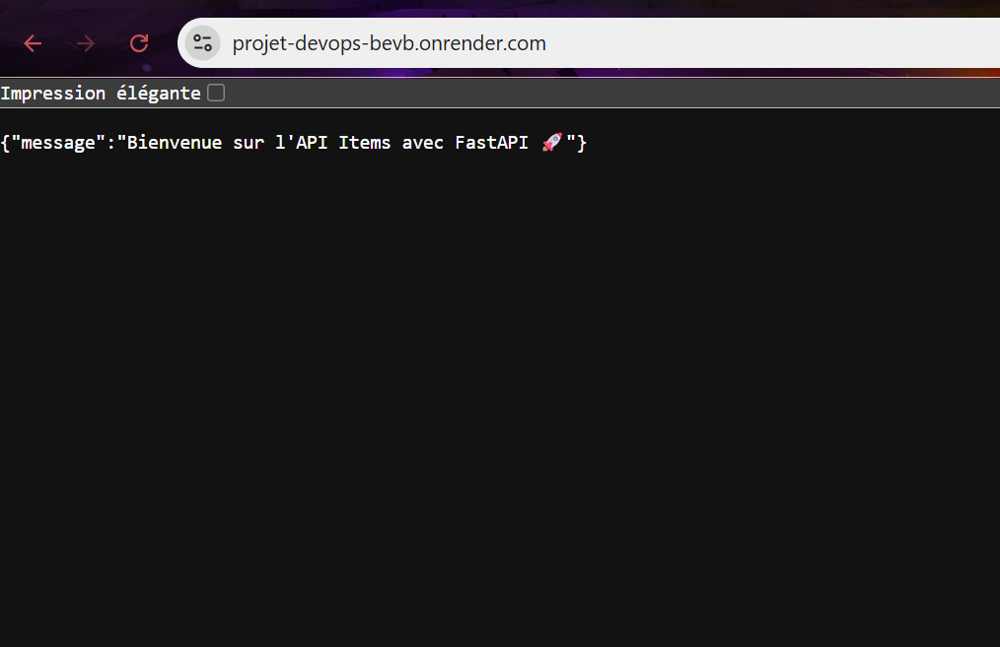
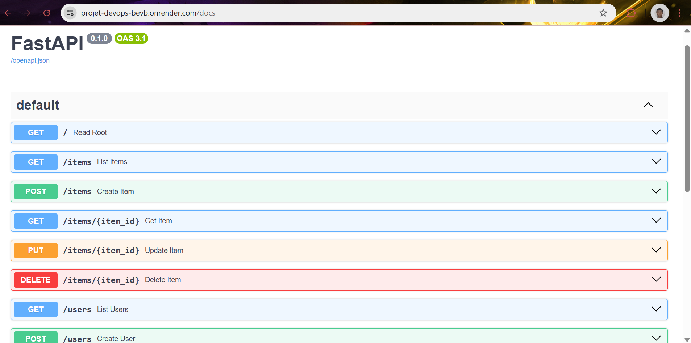

# 🚀 Projet FastAPI - Items & Users API

Ce projet est une API REST construite avec **FastAPI** permettant de gérer une liste d'utilisateurs et d'articles ("items"). Il inclut des tests automatisés avec `pytest` et une intégration continue via **GitHub Actions**.

---

## 🧱 Structure du projet

projet_devops/
│
├── app/
│ ├── init.py
│ ├── main.py # Point d'entrée de l'application
│ └── models.py # Modèles Pydantic
│
├── tests/
│ ├── init.py
│ ├── test_items.py # Tests pour les endpoints d'items
│ └── test_users.py # Tests pour les endpoints utilisateurs
│
├── .github/
│ └── workflows/
│ └── ci.yml # Définition de la CI GitHub Actions
│
├── requirements.txt # Dépendances du projet
└── README.md # Ce fichier


---

## 🖥️ Fonctionnalités

### Utilisateurs

- ✅ `GET /users` : Liste tous les utilisateurs
- ✅ `GET /users/{user_id}` : Détaille un utilisateur
- ✅ `POST /users` : Crée un nouvel utilisateur

### Items

- ✅ `GET /items` : Liste tous les items
- ✅ `GET /items/{item_id}` : Détaille un item
- ✅ `POST /items` : Crée un nouvel item
- ✅ `DELETE /items/{item_id}` : Supprime un item

---

## 📦 Installation & Lancement

### 1. Cloner le dépôt

```bash
git clone https://github.com/Kromaric/projet_devops.git
cd projet_devops
```
### 2. Installer les dépendances
```bash
python -m venv venv
source venv/bin/activate  # ou `venv\Scripts\activate` sous Windows
pip install -r requirements.txt
```
### 3. Lancer le serveur FastAPI

uvicorn app.main:app --reload
Le serveur sera accessible sur : http://127.0.0.1:8000

Documentation interactive : http://127.0.0.1:8000/docs

## ✅ Tests
Les tests sont écrits avec pytest.

Lancer les tests localement :
```bash
PYTHONPATH=. pytest
```
⚠️ Assurez-vous que app est bien dans le PYTHONPATH.

## 🔁 Intégration Continue (CI)
Le projet utilise GitHub Actions pour exécuter les tests automatiquement à chaque push ou pull request.
fichier de configuration de workflow : .github/workflows/ci.yml


## ☁️ Déploiement sur Render.com
📝 Étapes :
Créer un compte sur https://render.com

Connecter votre dépôt GitHub

Créer un nouveau service web (Web Service) :

Environment: Python 3

Build Command:
```bash
 pip install -r requirements.txt

```

Start Command:
```bash
 uvicorn app.main:app --host 0.0.0.0 --port 10000
```
Créer un fichier render.yaml (optionnel mais recommandé) :
```bash
services:
  - type: web
    name: fastapi-items-users
    env: python
    buildCommand: "pip install -r requirements.txt"
    startCommand: "uvicorn app.main:app --host 0.0.0.0 --port 10000"
    plan: free
    autoDeploy: true
```
## 🌐 Résultat
Une fois déployé, l’API est accessible via l'url :
https://projet-devops-bevb.onrender.com


Avec la documentation interactive sur :
https://projet-devops-bevb.onrender.com


## 📚 Technologies
✅ FastAPI

✅ Pydantic

✅ Pytest

✅ Uvicorn

✅ GitHub Actions (CI/CD)

### 🙌 Auteur
Romaric Kouadio
📧 romaricyt11@gmail.com

### 📄 Licence
Ce projet est sous licence MIT. Vous pouvez l'utiliser, le modifier et le redistribuer librement.